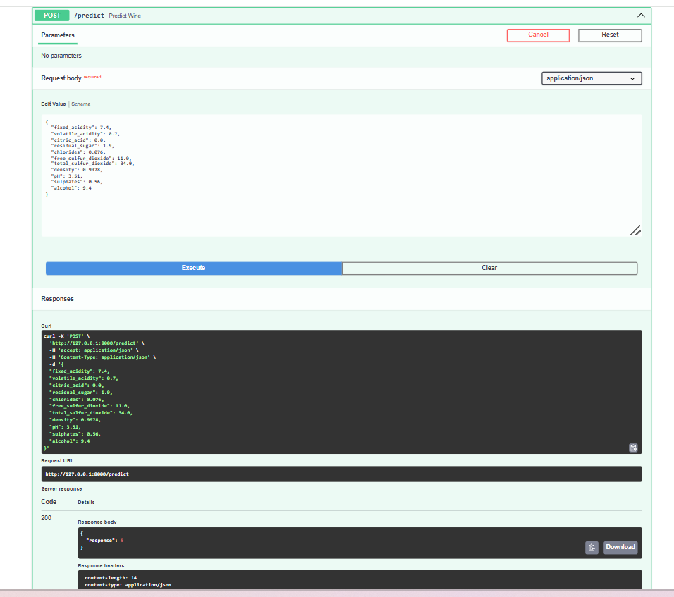

# Wine Quality Prediction API with Random Forest

## Overview

In this Lab, we will learn how to expose ML models as APIs using [FastAPI](https://fastapi.tiangolo.com/) and [uvicorn](https://www.uvicorn.org/).

1. **FastAPI**: FastAPI is a modern, fast (high-performance), web framework for building APIs with Python based on standard Python type hints.
2. **uvicorn**: Uvicorn is an [Asynchronous Server Gateway Interface - ASGI](https://youtu.be/vKjCkeJGbNk) web server implementation for Python. It is often used to serve FastAPI applications.

The workflow involves the following steps:
1. Training a Random Forest Classifier on WineQT Dataset.
2. Serving the trained model as an API using FastAPI and uvicorn.

## Setting up the lab

1. Create a virtual environment (e.g. **fastapi_labnew_env**).
2. Activate the environment and install the required packages using `pip install -r requirements.txt`.

### Project structure

```
mlops_labs
└── fastapi_labnew
    ├── assets/
    ├── fastapi_labnew_env/
    ├── model/
    │   ├── wine_model.pkl
    │   └── wine_scaler.pkl
    ├── src/
    │   ├── __init__.py
    │   ├── data.py
    │   ├── main.py
    │   ├── predict.py
    │   └── train.py
    ├── WineQT.csv
    ├── README.md
    └── requirements.txt
```

Note:
- **fastapi[all]** in **requirements.txt** will install optional additional dependencies for fastapi which contains **uvicorn** too.

## Running the Lab

1. First step is to train a Random Forest Classifier (Although you have **`model/wine_model.pkl`** when you cloned from the repo, let's create a new model). To do this, move into **src/** folder with
    ```bash
    cd src
    ```
2. To train the Random Forest Classifier, run:
    ```bash
    python train.py
    ```
3. To serve the trained model as an API, run:
    ```bash
    uvicorn main:app --reload
    ```
4. Testing endpoints - to view the documentation of your api model you can use [http://127.0.0.1:8000/docs](http://127.0.0.1:8000/docs) (or) [http://localhost:8000/docs](http://localhost:8000/docs) after you run your FastAPI app.


You can also test out the results of your endpoints by interacting with them. Click on the dropdown button of your endpoint -> Try it out -> Fill the Request body -> Click on Execute button.



- You can also use other tools like [Postman](https://www.postman.com/) for API testing.

### FastAPI Syntax

- The instance of FASTAPI class can be defined as:
    ```python
    app = FastAPI()
    ```
- When you run a FastAPI application, you often pass this app instance to an ASGI server uvicorn. The server then uses the app instance to handle incoming web requests and send responses based on the routes and logic you've defined in your FastAPI application.
- To run a FastAPI application, run:
    ```
    uvicorn main:app --reload
    ```
- In this command, **main** is the name of the Python file containing your app instance (without the .py extension), and **app** is the name of the instance itself. The **--reload** flag tells uvicorn to restart the server whenever code changes are detected, which is useful during development and should not be used in production.
- All the functions which should be used as API should be prefixed by **@app.get("/followed_by_endpoint_name")** or **@app.post("/followed_by_endpoint_name")**. This particular syntax is used to define route handlers (which function should handle an incoming request based on the URL and HTTP method), which are the functions responsible for responding to client requests to a given endpoint.
    1. **Decorator (@)**: This symbol is used to define a decorator, which is a way to dynamically add functionality to functions or methods. In FastAPI, decorators are used to associate a function with a particular HTTP method and path.
    2. **App Instance (app)**: This represents an instance of the FastAPI class. It is the core of your application and maintains the list of defined routes, request handlers, and other configurations.
    3. **HTTP Method (get, post, etc.)**: The HTTP method specifies the type of HTTP request the route will respond to. For example, get is used for retrieving data, and post is used for sending data to the server. FastAPI provides a decorator for each standard HTTP method, such as @app.put, @app.delete, @app.patch, and @app.options, allowing you to define handlers for different types of client requests. For detailed info refer to this website by [Mdn](https://developer.mozilla.org/en-US/docs/Web/HTTP/Methods).
    4. **Path/Endpoint ("/endpoint_name")**: This is the URL path where the API will be accessible. When a client makes a request to this path using the specified HTTP method, FastAPI will execute the associated function and return the response.
- Using **async** in FastAPI allows for non-blocking operations, enabling the server to handle other requests while waiting for I/O tasks, like database queries or model loading, to complete. This leads to improved concurrency and resource utilization, enhancing the application's ability to manage multiple simultaneous requests efficiently.

### Data Models in FastAPI

##### 1. WineData class

```python
class WineData(BaseModel):
    fixed_acidity: float
    volatile_acidity: float
    citric_acid: float
    residual_sugar: float
    chlorides: float
    free_sulfur_dioxide: float
    total_sulfur_dioxide: float
    density: float
    pH: float
    sulphates: float
    alcohol: float
```

The **WineData** class is a [Pydantic model](https://docs.pydantic.dev/latest/concepts/models/) which defines the expected structure of the data for a request body. When you use it as a type annotation for a route operation parameter, FastAPI will perform the following actions:
- **Request Body Reading:** FastAPI will read the request body as JSON.
- **Data Conversion:** It will convert the corresponding types, if necessary.
- **Data Validation:** It will validate the data. If the data is invalid, it will return a 422 Unprocessable Entity error response with details about what was incorrect.

#### 2. WineResponse class

```python
class WineResponse(BaseModel):
    response: int
```

The **WineResponse** class is another Pydantic model that defines the structure of the response data for an endpoint. When you specify **response_model=WineResponse** in a route operation, it tells FastAPI to:
- **Serialize the Output**: Convert the output data to JSON format according to the WineResponse model.
- **Document the API**: Include the WineResponse model in the generated API documentation, so API consumers know what to expect in the response.

---

### FastAPI features

1. **Request Body Reading**: When a client sends a request to a FastAPI endpoint, the request can include a body with data. For routes that expect data (commonly POST, PUT, or PATCH requests), this data is often in JSON format. FastAPI automatically reads the request body by checking the Content-Type header, which should be set to application/json for JSON payloads.

2. **Data Conversion**: Once the request body is read, FastAPI utilizes Pydantic models to parse the JSON data. Pydantic attempts to construct an instance of the specified model using the data from the request body. During this instantiation, Pydantic converts the JSON data into the proper Python data types as declared in the model.
   - For instance, if the JSON object has a field like fixed_acidity with a value of "7.4" (a string), and the model expects a float, Pydantic will transform the string into a float. If conversion isn't possible (say, the value was "seven point four"), Pydantic will raise a validation error.

3. **Data Validation**: Pydantic checks that all required fields are present and that the values are of the correct type, adhering to any constraints defined in the model (such as string length or number range). If the validation passes, the endpoint has a verified Python object to work with. If validation fails (due to missing fields, incorrect types, or constraint violations), FastAPI responds with a 422 Unprocessable Entity status. This response includes a JSON body detailing the validation errors, aiding clients in correcting their request data.

4. **Error Handling**: Error handling in FastAPI can be effectively managed using the HTTPException class. HTTPException is used to explicitly signal an HTTP error status code and return additional details about the error. When an HTTPException is raised within a route, FastAPI will catch the exception and use its content to form the HTTP response.

**Example:**
```python
from fastapi import FastAPI, HTTPException

app = FastAPI()

@app.get("/items/{item_id}")
async def read_item(item_id: int):
    item = get_item_by_id(item_id)  # Hypothetical function to fetch an item
    if item is None:
        raise HTTPException(status_code=404, detail=f"Item with ID {item_id} not found")
    return item
```

FastAPI will catch this exception and return a response with a 404 status code and a JSON body like this:
```json
{
    "detail": "Item with ID 1 not found"
}
```

For more information on how to handle errors in FastAPI refer to this [documentation](https://fastapi.tiangolo.com/tutorial/handling-errors/).

---

## API Endpoints

As shown in the API documentation screenshot above, the application provides the following endpoints:

### 1. Health Check Endpoint (`/Health Ping`)

- **Method**: GET
- **Description**: Check if the API service is running and healthy
- **Response**: Returns a status message confirming the service is operational

### 2. Predict Endpoint (`/predict`)

- **Method**: POST
- **Description**: Predict wine quality based on physicochemical properties
- **Request Body**: WineData model with all 11 features
- **Response**: WineResponse with predicted quality score

**Example Request:**
```json
{
  "fixed_acidity": 7.4,
  "volatile_acidity": 0.7,
  "citric_acid": 0.0,
  "residual_sugar": 1.9,
  "chlorides": 0.076,
  "free_sulfur_dioxide": 11.0,
  "total_sulfur_dioxide": 34.0,
  "density": 0.9978,
  "pH": 3.51,
  "sulphates": 0.56,
  "alcohol": 9.4
}
```

**Example Response:**
```json
{
  "response": 6
}
```

---

## Model Details

- **Algorithm**: Random Forest Classifier
- **Dataset**: WineQT.csv
- **Features**: 11 physicochemical properties of wine
- **Target**: Wine quality score (integer value)

---

## Testing the API

### Using the Interactive Documentation

1. Navigate to `http://localhost:8000/docs`
2. Click on the `/predict` endpoint
3. Click "Try it out"
4. Edit the request body with your wine parameters
5. Click "Execute"
6. View the response in the UI

### Using curl:
```bash
curl -X 'POST' \
  'http://127.0.0.1:8000/predict' \
  -H 'accept: application/json' \
  -H 'Content-Type: application/json' \
  -d '{
  "fixed_acidity": 7.4,
  "volatile_acidity": 0.7,
  "citric_acid": 0.0,
  "residual_sugar": 1.9,
  "chlorides": 0.076,
  "free_sulfur_dioxide": 11,
  "total_sulfur_dioxide": 34,
  "density": 0.9978,
  "pH": 3.51,
  "sulphates": 0.56,
  "alcohol": 9.4
}'
```

### Using Python:
```python
import requests

url = "http://127.0.0.1:8000/predict"
data = {
    "fixed_acidity": 7.4,
    "volatile_acidity": 0.7,
    "citric_acid": 0.0,
    "residual_sugar": 1.9,
    "chlorides": 0.076,
    "free_sulfur_dioxide": 11,
    "total_sulfur_dioxide": 34,
    "density": 0.9978,
    "pH": 3.51,
    "sulphates": 0.56,
    "alcohol": 9.4
}

response = requests.post(url, json=data)
print(response.json())
```

---

## Key Features

1. **Type Validation**: Automatic validation of input data types using Pydantic
2. **Interactive Documentation**: Auto-generated API docs with Swagger UI
3. **Error Handling**: Comprehensive error messages for debugging
4. **Scalable Architecture**: Separation of concerns with modular code structure
5. **Model Persistence**: Trained model saved and loaded for predictions

---

## Credits

- Framework: FastAPI and uvicorn
- Dataset: Wine Quality Dataset (WineQT.csv)
- Model: Random Forest Classifier from scikit-learn
